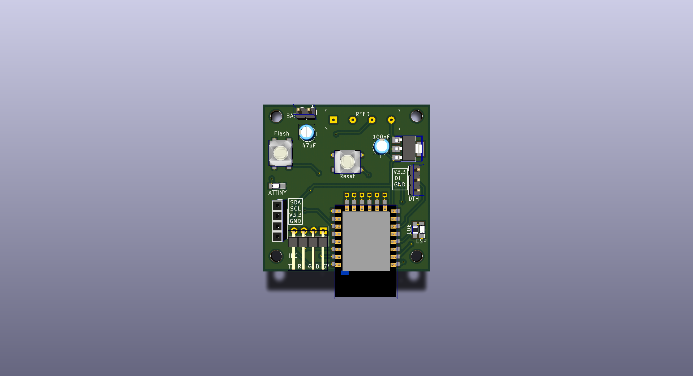
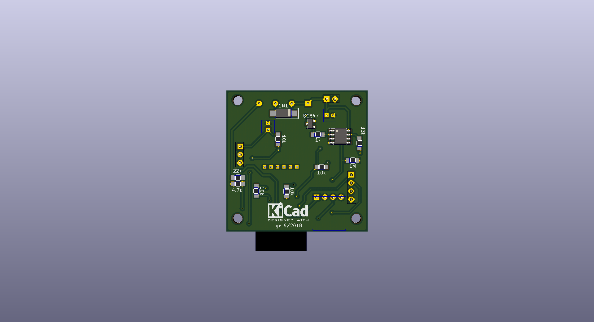

# EspSensorModule
## Attiny, Reed-Relay, ESP8266, DTH

## Project goals:
* timed meassurement of Temperature & Humidity
* battery driven (18650) with internal voltage meassurement
* small footprint
* optional display of status
* publish values via mqtt

## Items on store:
* ESP8266 microcontroller with wifi
* DTH11 / DTH22 temperature sensor
* ATtiny ultra low power microcontroller for timer-control
* 1A05 REED Relays
* SSD1306 128x32px OLED display
* BC846 npn transistor

## Schema:

## PCB:

